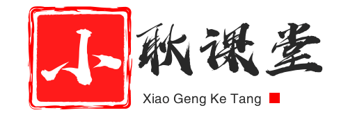

<h3 align="center">基于Vue和Django开发的在线视频教学网站</h1>

<a href="//github.com/gengwenhao/vue_django_mooc"> <a href="//github.com/gengwenhao/vue_django_mooc"> <a href="//github.com/gengwenhao/vue_django_mooc"> <a href="//github.com/gengwenhao/vue_django_mooc"> <a href="//github.com/gengwenhao/vue_django_mooc"> <a href="//github.com/gengwenhao/vue_django_mooc"> <a href="//gengwenhao.cn"> <a href="//github.com/gengwenhao">

<h4 align="center">首页预览</h4>

